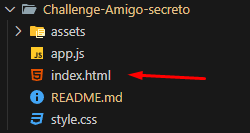
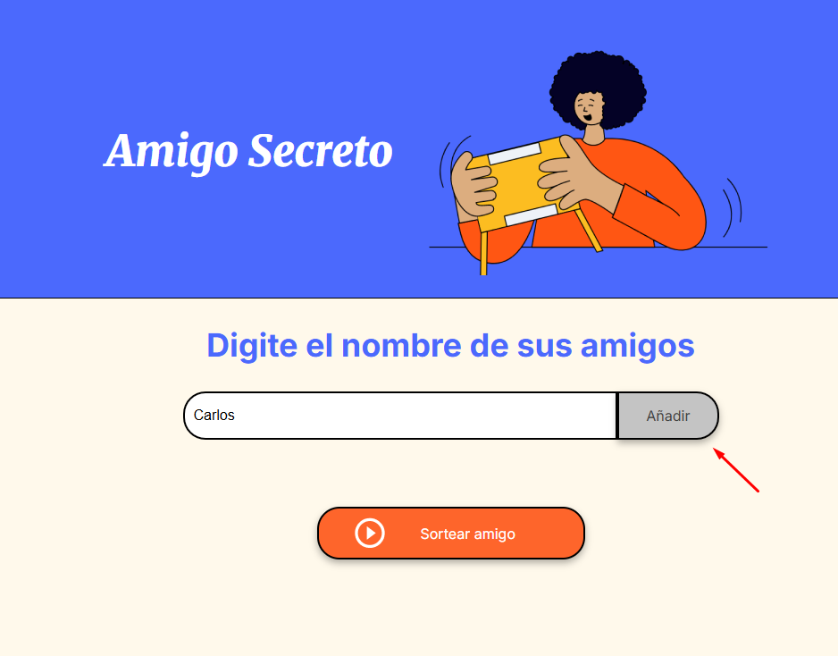
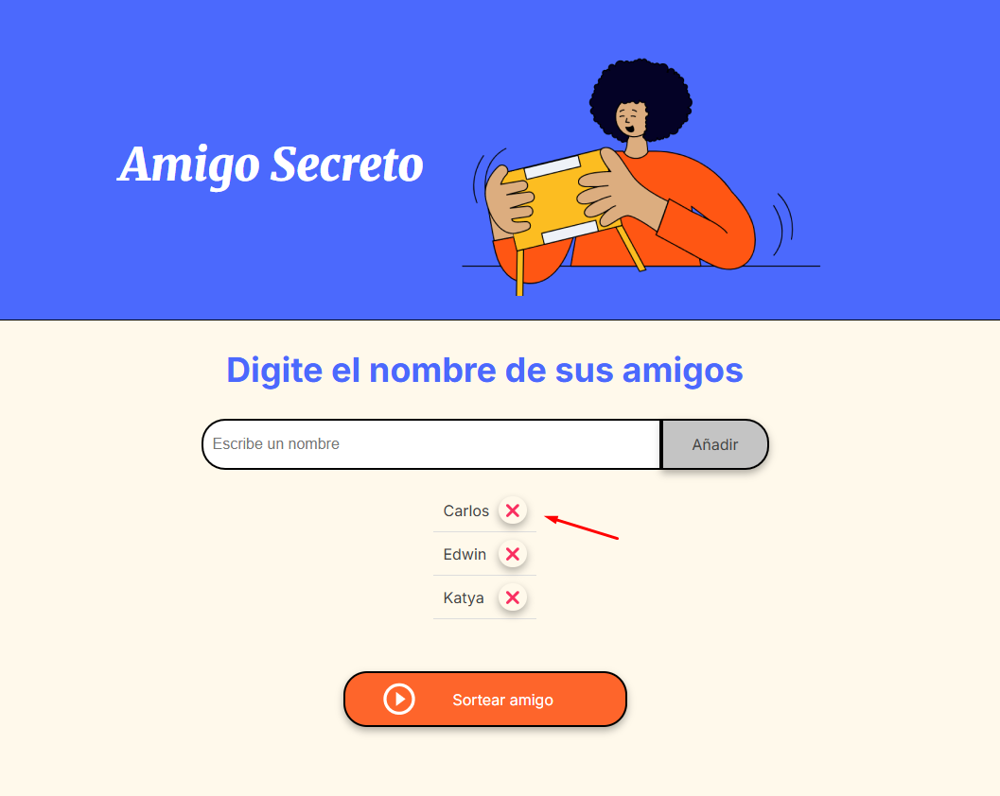
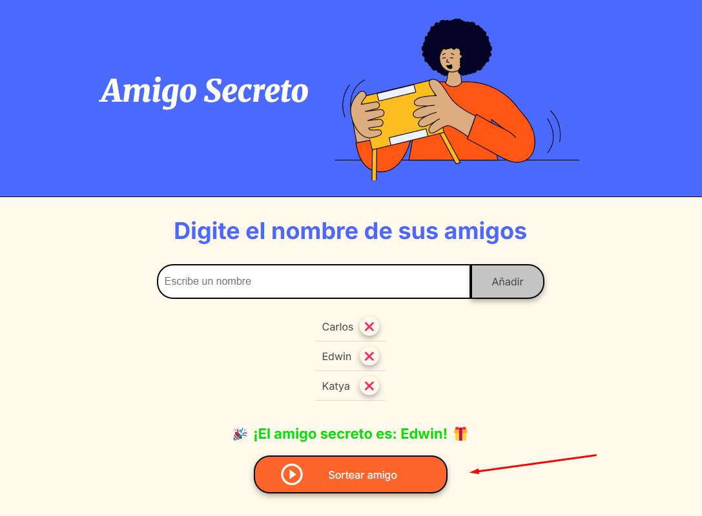

# Challenge-Amigo-secreto

Challenge de amigo secreto - alura generacion 8 

## 📌 Funcionalidades
✅ **Agregar nombres**: Se pueden ingresar nombres y agregarlos a la lista.  
✅ **Validar entrada**: No se permiten nombres vacíos ni repetidos.  
✅ **Visualizar la lista**: Los nombres ingresados aparecen en una lista interactiva.  
✅ **Sorteo aleatorio**: Selecciona un amigo al azar y lo muestra en pantalla.  
✅ **Eliminar nombres**: Se pueden borrar nombres de la lista.  

## 🚀 Instalación y Ejecución
1. Descarga el proyecto o clona el repositorio:
   ```sh
   git clone https://github.com/usuario/amigo-secreto.git

2. Abrir el archivo index.html en un navegador  

    Abre la carpeta del proyecto.  
    Haz doble clic en index.html para abrirlo en tu navegador.  
  

3. Ingrese el nombre y puede darle click a "añadir" o presionar "ENTER"

  

4. Puede eliminar algun nombre si lo desea presionando la "❌"

 

5. ¡Sortee a su amigo secreto!

 